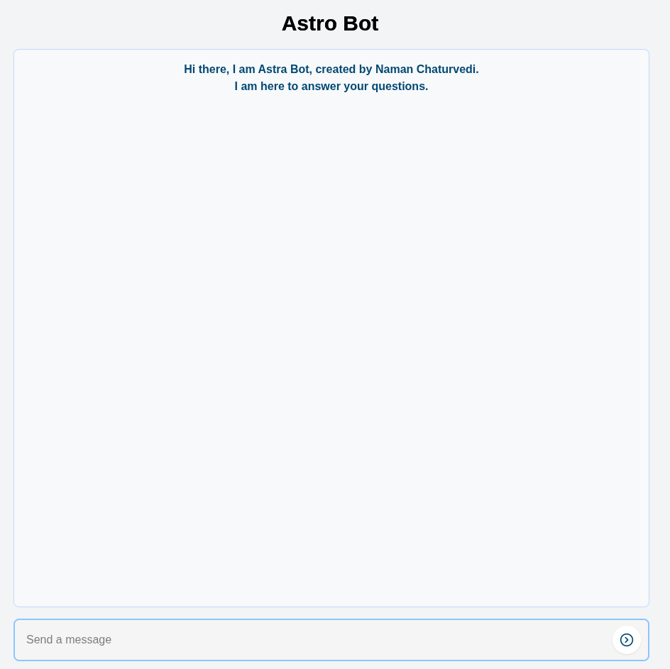

# Personal AI Chatbot

A locally-hosted AI chatbot with a frontend built using Next.js and Tailwind CSS, powered by Google Gemma's 1 Billion parameter model running on your discrete GPU.

## Features

- Fully local deployment – no cloud dependency.
- Responsive and modern frontend with Next.js and Tailwind CSS.
- Leverages Gemma 1B model for efficient and fast AI responses.
- Runs directly on your discrete GPU for optimal performance.
- Personalized using context data.

## Usage

- You can ask the AI about me via the frontend interface: [https://chat.halfskirmish.com](https://chat.halfskirmish.com)
- Designed for learning and personal projects.

## Tech Stack

- **Frontend:** Next.js, Tailwind CSS
- **AI Model:** Gemma 1 Billion parameters
- **Hardware:** Hosted on a personal secondary system running a GTX 1650

## Screenshot

